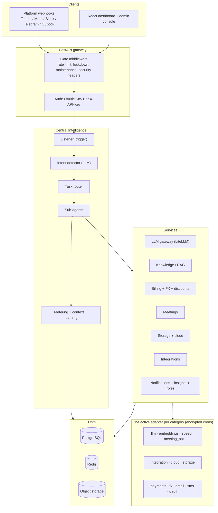
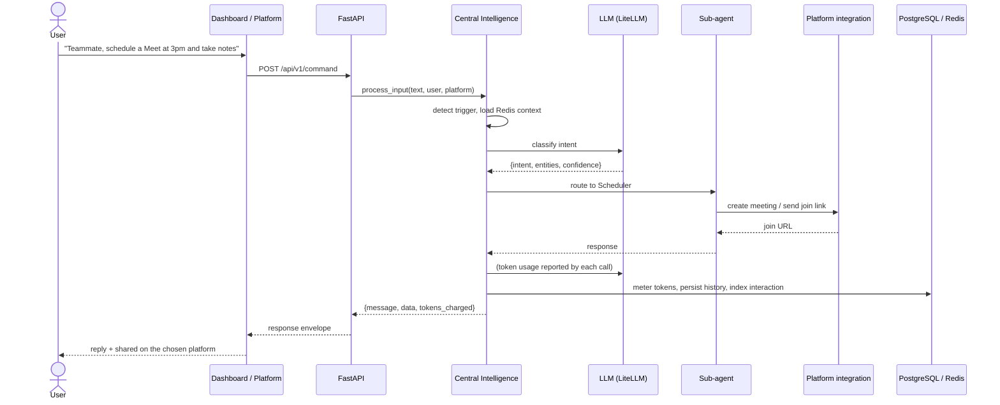
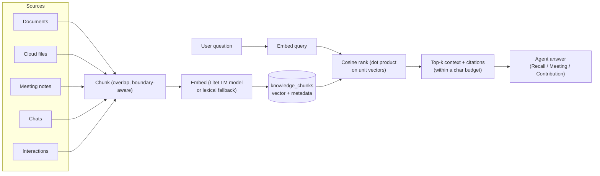
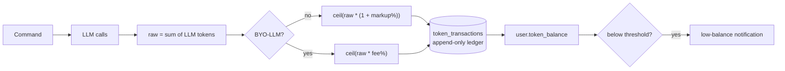

# Teammate

**An AI collaborator that represents you at work.** Address it in plain language,
starting with the word "Teammate", and it schedules meetings, joins and
contributes to them, takes notes and minutes, presents decks, sends and broadcasts
messages, finds and answers from your files, recalls context from everything you
have connected, and drafts what you should say, across Microsoft Teams, Google
Meet, Slack, Telegram, and Outlook.

The goal: a private second brain plus an autonomous proxy, so you never miss
anything, never forget anything, and always walk in with full context.

This is the complete, single-page documentation for the whole system.

---

## Table of contents

1. [What Teammate is](#1-what-teammate-is)
2. [Features](#2-features)
3. [The agents](#3-the-agents)
4. [Architecture (diagram)](#4-architecture)
5. [User flow (diagram)](#5-user-flow)
6. [Data flow (diagram)](#6-data-flow)
7. [The command pipeline](#7-the-command-pipeline)
8. [Provider registry](#8-provider-registry)
9. [Providers and API keys](#9-providers-and-api-keys)
10. [Billing and subscriptions (the math)](#10-billing-and-subscriptions-the-math)
11. [Algorithms and techniques](#11-algorithms-and-techniques)
12. [Security and compliance](#12-security-and-compliance)
13. [Data model](#13-data-model)
14. [Background jobs](#14-background-jobs)
15. [Repositories](#15-repositories)
16. [Getting started](#16-getting-started)

---

## 1. What Teammate is

Teammate is a multi-agent AI collaborator. You speak to it in natural language and
it acts across your work tools. Three principles run through the whole system:

1. **Everything is admin-controllable at runtime.** Every third-party service is a
   swappable provider configured from the admin dashboard, with keys encrypted at
   rest. No code changes or redeploys to switch an LLM, a payment processor, or a
   meeting bot.
2. **Every platform is equal.** Teams, Meet, Slack, Telegram, and Outlook all
   expose the same capability surface (messaging, meetings, files, notes,
   presenting). The only difference is which one the user connects.
3. **The user owns their data.** Their own connected cloud takes precedence for
   their files; Teammate storage is a fallback with clear, per-tier limits and
   retention.

**Tech stack.** Backend: Python 3.12, FastAPI, SQLAlchemy 2 (async) with Alembic,
PostgreSQL, Redis, Celery, LiteLLM, Authlib/PyJWT, cryptography (Fernet). Frontend:
React 18, Vite, Tailwind, TanStack Query, Zustand, framer-motion. Infrastructure:
Docker Compose, a Helm chart for Kubernetes and on-prem, and GitHub Actions CI.

---

## 2. Features

- **Meetings, on your behalf.** A meeting session carries an autonomy policy
  (attend, take notes, answer when asked, speak, interject, present, record, plus a
  persona and standing instructions). Teammate follows the transcript and
  contributes only within those permissions, then writes and delivers the minutes.
  Live presence (join, record, speak, transcript) runs through a meeting-bot
  provider (Recall.ai); a built-in assisted mode works with no media provider.
- **Personal knowledge base (second brain).** Everything you connect or do
  (documents, cloud files, meeting notes, chats, your own interactions) is indexed
  privately. Recall answers across all of it with citations, blended with general
  knowledge.
- **Unified file manager.** Browse every connected cloud (Dropbox, Drive, OneDrive)
  like one file system: folders, upload, download, new folder, delete, in one place.
- **Documents.** Upload files; text is extracted from PDF, DOCX, PPTX, XLSX, CSV,
  and TXT so agents can read and present from real content.
- **Messaging and scheduling.** Single and bulk messages and reminders, real
  meeting creation with join links, deck talk-tracks, and role-aware next steps, on
  whichever platform you use.
- **Storage precedence and retention.** Your own cloud takes precedence; Teammate
  storage is a fallback, capped and retained per tier. Files past retention
  auto-delete unless you download them or move them to your own cloud.
- **Billing and BYO-LLM.** Consumption-based token metering, per-tier plans,
  flexible top-ups, promo codes, and bring-your-own-LLM (billed at a reduced
  platform-fee rate, with automatic fallback to the platform model if your key
  fails).
- **Enterprise API.** SHA-256-hashed API keys for programmatic access.
- **Admin control plane.** Configure/test/switch every provider, tune runtime
  settings, manage users, run discounts, and hit emergency kill-switches.
- **History, notifications, insights, workflows.** Searchable interaction history,
  in-app and email notifications, AI insights over activity, and user-defined
  automations.
- **UX.** Teal/coral/lemon design system, light and dark, and an animated "working"
  indicator so the screen is never blank during a long action.

---

## 3. The agents

Central Intelligence routes each request to a specialist sub-agent.

| Agent | Intent | What it does |
|---|---|---|
| Central Intelligence | (orchestrator) | Runs the pipeline, meters tokens, remembers context. |
| Listener | (gate) | Trigger-word detection and dismissal handling. |
| Intent Detector | (classify) | LLM classification with a confidence threshold and fallback. |
| Scheduler | schedule/cancel/info | Creates real meetings, sources a join link, sends reminders. |
| Note-Taker | take_notes | Structured notes and summaries, saved to the chosen storage and indexed. |
| Presenter | present_slides | Reads a deck (PPTX/PDF) into a slide-by-slide talk track. |
| Communicator | send_message | Drafts and sends a single message on the chosen platform. |
| Broadcast | broadcast_message | Bulk messages and reminders to many recipients at once. |
| Document-Reader | query_document | Answers from a specific uploaded document's real text. |
| Finder | find_files | One search across every connected cloud and imported documents. |
| Recall | ask_knowledge | Answers across the whole knowledge base with citations, blended with general knowledge. |
| Contribution | draft_contribution | Drafts what the user could say, grounded in their knowledge. |
| Meeting | (sessions) | Follows a live transcript and contributes within the autonomy policy; writes minutes. |
| Suggestor | get_suggestions | Turns discussion into next steps, role-aware. |
| Role Analyzer | (opt-in) | Infers the user's role to personalize suggestions. |
| Fallback | (unknown) | Clarifies or handles anything unrecognized gracefully. |

---

## 4. Architecture



---

## 5. User flow

A single command, "Teammate, schedule a Meet at 3pm and take notes", end to end:



---

## 6. Data flow

How the knowledge base is built and queried (Retrieval-Augmented Generation):



Billing data flow (per command):



---

## 7. The command pipeline

A user utterance flows through `src/agents/`:

1. **listener.py** gates on the literal word "Teammate" and strips it. A bare
   dismissal ("Teammate, ignore that") is acknowledged and does nothing.
2. **central_intelligence.py** loads Redis context, resolves the user's BYO-LLM
   config, classifies intent, routes, meters tokens for every LLM call, persists
   context and history, and learns from the exchange.
3. **intent_detector.py** classifies the utterance into an intent with a confidence
   score; low confidence or unknown routes to the fallback.
4. **task_router.py** maps the intent to a sub-agent handler via a plain dict.
5. **Sub-agents** each produce a response and can deliver it to the user's platform.

Token metadata (`cost_tokens`, `model_used`, `is_byollm`, `fell_back`) is threaded
through every stage so the orchestrator bills correctly. BYO-LLM usage is billed
only a platform fee; a failed BYO-LLM key falls back to the platform model.

---

## 8. Provider registry

Every third-party service is a swappable **provider**, managed in
**Admin > Providers**, grouped by category. The lifecycle is always: **Configure**
(fill credential fields), **Test** (live auth check), **Set active** (one active
per category). Switching is hot: no redeploy. Every secret field is encrypted with
Fernet before storage and never echoed back.

Categories: **llm, embeddings (a setting), speech, meeting_bot, integration, cloud,
oauth, payments, fx, email, sms, storage**.

---

## 9. Providers and API keys

Field notation: `*` required, `(secret)` encrypted at rest. To go live you only
need **one LLM** and **one sign-in provider (Google or GitHub)**; everything else
is optional and hot-swappable. FX (`erapi`), storage (`local`), and the meeting bot
(`assisted`) work by default with no setup.

### LLM (set one active; all calls go through LiteLLM as `provider/model`)

| Provider | Get keys | Fields |
|---|---|---|
| **anthropic** (Claude) | https://console.anthropic.com/settings/keys | `api_key`*(secret), `model`* e.g. `anthropic/claude-sonnet-4-20250514` |
| **openai** (GPT) | https://platform.openai.com/api-keys | `api_key`*(secret), `model`* e.g. `openai/gpt-4o` |
| **gemini** (Google) | https://aistudio.google.com/app/apikey | `api_key`*(secret), `model`* e.g. `gemini/gemini-1.5-pro` |
| **ollama** (self-hosted, free) | https://ollama.com/download | `api_base`* e.g. `http://localhost:11434`, `model`* e.g. `ollama/llama3` |

**Embeddings** (knowledge recall): optional. Set the runtime setting
`embedding_model` to a LiteLLM embedding id (e.g. `openai/text-embedding-3-small`);
otherwise a built-in lexical fallback is used. Reuses the LLM key unless
`embedding_api_key` is set.

### Meeting bot (live presence)

| Provider | Get keys | Fields |
|---|---|---|
| **assisted** (default) | none | none. Transcript in via API, decisions out. |
| **recall** (Recall.ai) | https://www.recall.ai/ then dashboard API Keys; docs https://docs.recall.ai/ | `api_key`*(secret), `region` (default `us-west-2`, base `https://<region>.recall.ai`), `bot_name` |

Validate a live Recall run with `teammate-backend/scripts/verify_recall.py`.

### Speech (voice)

| Provider | Get keys | Fields |
|---|---|---|
| **elevenlabs** | https://elevenlabs.io/app/settings/api-keys | `api_key`*(secret), `voice_id` |
| **azure** | https://portal.azure.com/ (create a Speech resource) | `subscription_key`*(secret), `region`* e.g. `eastus`, `voice` e.g. `en-US-JennyNeural` |

### Integration (platforms users connect; register one app each)

| Provider | Get keys | Fields |
|---|---|---|
| **telegram** | https://t.me/BotFather (`/newbot`) | `bot_token`*(secret), `webhook_secret`(secret) |
| **slack** | https://api.slack.com/apps | `bot_token`*(secret), `signing_secret`*(secret) |
| **teams** | https://portal.azure.com App registrations; docs https://learn.microsoft.com/graph/auth-register-app-v2 | `client_id`*, `client_secret`*(secret), `tenant_id` |
| **google_meet** (Meet + Gmail) | https://console.cloud.google.com/apis/credentials | `client_id`*, `client_secret`*(secret) |
| **outlook** (Calendar + Mail) | https://portal.azure.com App registrations | `client_id`*, `client_secret`*(secret), `tenant_id` |

### Cloud (per-user OAuth storage; register one app, each user connects their own)

| Provider | Get keys | Fields |
|---|---|---|
| **dropbox** | https://www.dropbox.com/developers/apps | `client_id`*, `client_secret`*(secret) |
| **google_drive** | https://console.cloud.google.com/apis/credentials (enable Drive API) | `client_id`*, `client_secret`*(secret) |
| **onedrive** | https://portal.azure.com App registrations (Graph Files perms) | `client_id`*, `client_secret`*(secret) |

### OAuth sign-in (Google and GitHub only)

| Provider | Get keys | Fields |
|---|---|---|
| **google** | https://console.cloud.google.com/apis/credentials | `client_id`*, `client_secret`*(secret) |
| **github** | https://github.com/settings/applications/new | `client_id`*, `client_secret`*(secret) |

### Payments (routed by currency: Paystack for local African, Stripe otherwise)

| Provider | Get keys | Fields |
|---|---|---|
| **stripe** | https://dashboard.stripe.com/apikeys ; webhooks https://dashboard.stripe.com/webhooks | `secret_key`*(secret), `webhook_secret`(secret) |
| **paystack** | https://dashboard.paystack.com/#/settings/developers | `secret_key`*(secret) |

### FX, email, SMS, storage

| Category | Provider | Get keys | Fields |
|---|---|---|---|
| FX | **erapi** (free, default) | none (https://www.exchangerate-api.com/) | none |
| FX | **exchangerate_host** | https://exchangerate.host/ | `access_key`*(secret) |
| Email | **smtp** | your mail server | `host`*, `port`*, `username`*, `password`*(secret), `from_email`, `use_tls` |
| Email | **resend** | https://resend.com/api-keys | `api_key`*(secret), `from_email` |
| SMS | **twilio** | https://console.twilio.com/ | `account_sid`*, `auth_token`*(secret), `from_number`* |
| SMS | **termii** | https://termii.com/ (docs https://developer.termii.com/) | `api_key`*(secret), `sender_id`* |
| Storage | **local** (default) | none | `base_dir` |
| Storage | **s3** (or MinIO / DO Spaces) | https://s3.console.aws.amazon.com/ | `access_key`*, `secret_key`*(secret), `bucket`*, `region`, `endpoint_url` |
| Storage | **cloudinary** | https://console.cloudinary.com/ | `cloud_name`*, `api_key`*, `api_secret`*(secret) |

### OAuth redirect URLs

Every OAuth provider (sign-in, integrations, cloud) validates a redirect/callback
URL you register on its side: your public `BACKEND_URL` plus a callback path, e.g.
sign-in `BACKEND_URL/api/v1/auth/callback/<provider>` and cloud
`BACKEND_URL/api/v1/cloud/connect/<provider>/callback`. The exact path is shown in
Admin > Providers for each one. Use HTTPS in any non-local environment and match
the path exactly.

---

## 10. Billing and subscriptions (the math)

A user spends two things: **monthly commands** (a per-tier volume cap, 402
`command_limit_reached` when exhausted, reset monthly) and **tokens** (the
consumption currency, roughly one platform token equals one LLM token of work).

### Plans

| | Free | Starter | Pro | Enterprise |
|---|---|---|---|---|
| Price / month | 0 | 15 | 35 | 99 |
| Monthly commands | 50 | 500 | 5000 | unlimited |
| Monthly bonus tokens | 0 | 50 | 200 | 500 |
| Connectable clouds | 1 | 2 | 3 | 3 |
| Teammate storage | 100 MB | 1 GB | 5 GB | unlimited |
| File retention | 7 days | 30 days | 90 days | forever |
| Top-up range | 5 to 50 | 5 to 300 | 10 to 1000 | 50 to 10000 |

### Consumption metering (how the minus works)

Each command's LLM usage (`raw` tokens) is charged by who provided the model:

- **Teammate's LLM:** `charge = ceil(raw * (1 + platform_llm_markup_percent/100))`
  (default 10%, so 1000 tokens deducts 1100).
- **BYO-LLM:** `charge = ceil(raw * byollm_platform_fee_percent/100)` (default 10%,
  so 1000 tokens deducts only 100; the user pays their own provider for the model).

Both use `ceil` with a `max(1, ...)` floor, so nonzero usage always costs at least
one token. The balance may dip slightly negative so a user is never cut off
mid-action; a low-balance alert fires at `low_balance_threshold` (default 200). If a
BYO-LLM key fails, the command runs on Teammate's model and is billed as such.

### Top-ups, FX, discounts

- **Top-up:** `tokens_granted = round(amount * tokens_per_base_unit)` (default
  10000 per unit), within the tier's range (402 `topup_out_of_range` otherwise).
- **FX:** `charged = base_amount * live_rate * (1 + fx_markup_percent/100)` (default
  10%), converted live and shown transparently at checkout.
- **Discounts:** percent off, fixed off, or free tokens; with scope, global and
  per-user caps, and a validity window; evaluated in base currency before FX.

### Worked examples

- Pro, platform LLM, 2000-token command: `ceil(2000 * 1.10) = 2200` tokens.
- Pro, BYO-LLM, same command: `ceil(2000 * 0.10) = 200` tokens.
- Starter tops up 20: `20 * 10000 = 200000` tokens.
- Pro at 35 USD in NGN, rate 1600, 10% markup: `35 * 1600 * 1.10 = 61600` NGN via
  Paystack.

---

## 11. Algorithms and techniques

Each links to its concept for further reading. Implemented in `teammate-backend/src`.

**Agents and pipeline**
- **Wake-word gating** (`listener.py`): cheap substring gate + regex strip.
  [Keyword spotting](https://en.wikipedia.org/wiki/Keyword_spotting)
- **Intent classification with threshold + fallback** (`intent_detector.py`,
  `task_router.py`): LLM as a zero-shot classifier returning JSON, gated by a
  confidence threshold.
  [Intent classification](https://en.wikipedia.org/wiki/Intent_classification)
- **Meeting decision policy** (`meeting_agent.py`): permission-gated LLM decision to
  speak/interject/stay silent.
  [Least privilege](https://en.wikipedia.org/wiki/Principle_of_least_privilege)
- **Redis context with TTL** (`context_manager.py`): 1-hour sliding window.
  [Time to live](https://en.wikipedia.org/wiki/Time_to_live)

**Knowledge base (RAG)**
- **RAG pipeline** (`knowledge_service.py`): chunk, embed, retrieve, assemble.
  [Lewis et al. 2020](https://arxiv.org/abs/2005.11401)
- **Overlapping boundary-aware chunking**: 1200-char windows, 150 overlap, prefers
  paragraph/sentence boundaries.
  [Text segmentation](https://en.wikipedia.org/wiki/Text_segmentation)
- **Cosine ranking on unit vectors** (`embedding_service.py`): normalized vectors so
  cosine is a dot product.
  [Cosine similarity](https://en.wikipedia.org/wiki/Cosine_similarity)
- **Dependency-free lexical fallback embedding** (`_hash_embed`): the hashing trick
  with a stable blake2b hash into a 512-dim vector, L2-normalized.
  [Feature hashing](https://en.wikipedia.org/wiki/Feature_hashing)
- **Incremental cloud sync** (`sync_service.py`): skip already-indexed, bounded per
  run. [Incremental computing](https://en.wikipedia.org/wiki/Incremental_computing)

**Billing and finance**
- **Metered token billing** (`billing_service.py`): markup vs BYO-LLM fee, ceil.
  [Pay-per-use](https://en.wikipedia.org/wiki/Pay-per-use)
- **Append-only token ledger**: every change writes a running-balance row.
  [Ledger](https://en.wikipedia.org/wiki/Ledger)
- **Live FX with markup + Redis cache** (`fx_service.py`).
  [Exchange rate](https://en.wikipedia.org/wiki/Exchange_rate)
- **Region-based payment routing + minor-unit conversion** (ISO 4217 zero-decimal
  handling). [ISO 4217](https://en.wikipedia.org/wiki/ISO_4217)
- **Idempotent fulfillment** (`verify_payment`): grant exactly once.
  [Idempotence](https://en.wikipedia.org/wiki/Idempotence)
- **Discount engine** (`discount_service.py`): ordered guards, clamped effects.
- **Retention purge** (`storage_service.py`): TTL sweep over stored files.
  [Data retention](https://en.wikipedia.org/wiki/Data_retention)

**Security**
- **JWT HS256** (`core/security.py`).
  [RFC 7519](https://datatracker.ietf.org/doc/html/rfc7519)
- **Session epoch invalidation** (`deps.py`, `emergency_service.py`): reject tokens
  issued before a per-user or global epoch for instant force-logout.
  [RFC 7009](https://datatracker.ietf.org/doc/html/rfc7009)
- **Enterprise API keys, SHA-256 hashed** (`api_key_service.py`).
  [SHA-2](https://en.wikipedia.org/wiki/SHA-2)
- **Fixed-window rate limiting per identity** (`middleware/gate.py`).
  [Rate limiting](https://en.wikipedia.org/wiki/Rate_limiting)
- **Fernet encryption at rest** (`core/encryption.py`): AES-128-CBC + HMAC-SHA256.
  [Fernet spec](https://github.com/fernet/spec/blob/master/Spec.md)
- **RBAC with a rank hierarchy** (`core/rbac.py`).
  [RBAC](https://en.wikipedia.org/wiki/Role-based_access_control)
- **Webhook signature verification** (Slack/Stripe HMAC-SHA256, Paystack
  HMAC-SHA512, Telegram secret token), constant-time compare.
  [HMAC RFC 2104](https://datatracker.ietf.org/doc/html/rfc2104)

**Cross-cutting**
- **Offset pagination with an allow-listed sort** (`api/pagination.py`).
  [Pagination](https://en.wikipedia.org/wiki/Pagination)
- **BYO-LLM priority with failover** (`llm_service.py`).
  [Failover](https://en.wikipedia.org/wiki/Failover)
- **Cache-aside fast-path flags** in Redis mirroring durable settings
  (`emergency_service.py`).
  [Cache](https://en.wikipedia.org/wiki/Cache_(computing))

---

## 12. Security and compliance

Honesty note: this describes what is implemented and the frameworks it is designed
to align with; it is not a claim of formal certification.

- **Auth:** password-less OAuth2 (Google, GitHub) issuing JWT access/refresh
  tokens; Enterprise API uses `X-API-Key`.
- **Instant revocation:** monotonic per-user and global session epochs; an admin
  force-logout bumps the epoch and rejects all older tokens at once.
- **RBAC:** admin, user, viewer, plus tier gating for Enterprise features.
- **Encryption:** HTTPS/TLS in transit; every stored secret encrypted with Fernet
  (AES-128-CBC + HMAC-SHA256) keyed by `ENCRYPTION_KEY`; secrets never returned in
  plaintext.
- **Request gate:** per-identity rate limiting, maintenance and lockdown modes, IP
  blocklist, and security headers (CSP, HSTS, X-Frame-Options, and more) on every
  response.
- **Webhook integrity:** Slack/Stripe/Paystack signatures and a Telegram secret
  token; payments are re-verified with the provider before any fulfillment.
- **Payment data:** never stored by Teammate; card processing is entirely on Stripe
  or Paystack (PCI DSS compliant).
- **Privacy and consent:** explicit opt-in for sensitive processing (Role
  Analyzer); meeting recording is off by default and requires policy opt-in.
  Operators must announce the bot and obtain consent where required by
  [call-recording laws](https://en.wikipedia.org/wiki/Telephone_call_recording_laws).
- **Data laws:** aligned with [GDPR](https://gdpr.eu/) (consent, data minimization,
  access and erasure, encryption) and [CCPA](https://oag.ca.gov/privacy/ccpa)
  (disclosure and deletion). Data is scoped by `user_id` and deletes on cascade;
  users' own cloud data stays in their account. Teammate storage auto-deletes on a
  per-tier retention window; object storage can be pinned to a region.
- **Auditability:** sensitive actions are written to an append-only `audit_logs`
  table.
- **Kill switches** for signups, commands, payments, and integrations.

---

## 13. Data model

PostgreSQL via SQLAlchemy async with Alembic migrations. Key tables: `users`,
`oauth_accounts`, `organizations`, `provider_configs`, `runtime_settings`,
`audit_logs`, `subscription_plans`, `token_packs`, `token_transactions`,
`subscriptions`, `payments`, `discounts`, `discount_redemptions`,
`integration_connections`, `documents`, `interactions`, `notifications`,
`api_keys`, `workflows`, `knowledge_chunks`, `meeting_sessions`. Redis backs
conversational context (1-hour TTL), caching, rate limits, and the Celery broker.

---

## 14. Background jobs

Celery beat (`teammate-backend/src/tasks/`):

| Job | Cadence | Purpose |
|---|---|---|
| run_due_workflows | every minute | Scheduled workflows and reminders. |
| sync_knowledge | every 30 min | Index new cloud files into the knowledge base. |
| purge_expired_storage | daily | Delete Teammate files past their tier retention. |
| reset_monthly_usage | monthly | Reset monthly command counters. |

---

## 15. Repositories

| Repo | What it is |
|---|---|
| **teammate-backend** | The FastAPI multi-agent engine and API. |
| **teammate-frontend** | The React dashboard and admin console. |
| **teammate-infrastructure** | Docker, Helm, CI, and the detailed docs set (OPERATIONS, SYSTEM, PROVIDERS, BILLING, ALGORITHMS, SECURITY_AND_COMPLIANCE, ROADMAP). |

---

## 16. Getting started

1. In `teammate-backend`, copy `.env.example` to `.env` and set `SECRET_KEY`,
   `ENCRYPTION_KEY`, `DATABASE_URL`, `REDIS_URL`, `FIRST_ADMIN_EMAIL`, and one OAuth
   sign-in app.
2. Start databases: `make db-up` (or `make up` to run databases in Docker and the
   app natively). Full stack: `cd teammate-infrastructure/docker && docker compose
   up -d`. Migrations and seeding run **automatically on startup**, so there is
   nothing to run by hand.
3. Sign in once with the first-admin email; that account becomes admin.
4. Open **Admin > Providers**, configure one LLM, and set it active. Add anything
   else (payments, speech, meeting bot, integrations, cloud) any time, no downtime.

Generate the two secrets:

```bash
openssl rand -hex 32                                                                   # SECRET_KEY
python -c "from cryptography.fernet import Fernet; print(Fernet.generate_key().decode())"  # ENCRYPTION_KEY
```

The minimum to go live is one LLM plus one sign-in provider. For the full
step-by-step, see `teammate-infrastructure/docs/OPERATIONS.md`.
